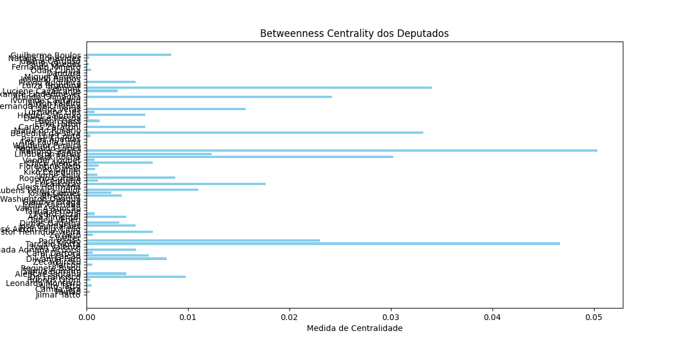
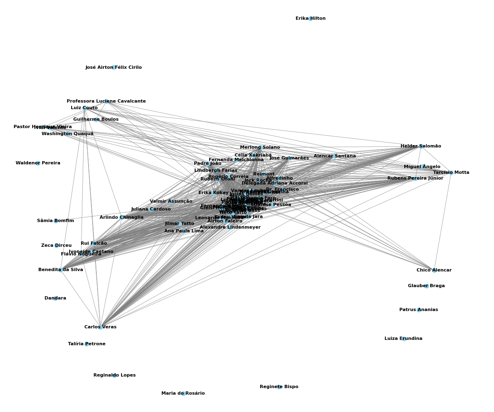
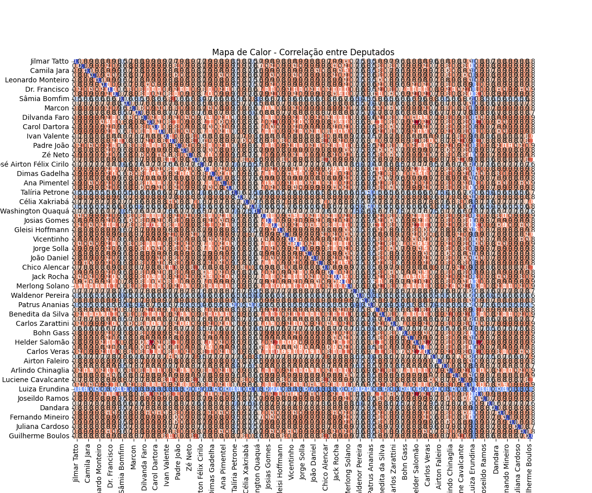

# Análise de Votos Parlamentares

Compartilhando meu projeto de análise de dados, desenvolvido como parte da disciplina *Algoritmo e Estrutura de Dados 3*.

## Descrição

Este projeto é uma análise de votos parlamentares utilizando Python. O código utiliza as bibliotecas **NetworkX**, **Matplotlib** e **Seaborn** para explorar padrões e relações nos votos. A análise inclui a construção de um grafo de votos, filtragem por partidos políticos, normalização de pesos, aplicação de threshold e cálculo da centralidade de betweenness.

## Funcionalidades

- **Construção de Grafo:** Cria um grafo representando as relações entre votos dos parlamentares.
- **Filtragem por Partidos:** Permite filtrar os votos por partidos políticos específicos.
- **Normalização de Pesos:** Normaliza os pesos das arestas do grafo para análises mais precisas.
- **Aplicação de Threshold:** Define um limiar para filtrar as arestas do grafo com base em seus pesos.
- **Cálculo da Centralidade de Betweenness:** Calcula a centralidade de betweenness para identificar parlamentares influentes.

## Tecnologias Utilizadas

- **Linguagem:** Python
- **Bibliotecas:**
  - **NetworkX:** Para a construção e análise de grafos.
  - **Matplotlib:** Para visualização gráfica.
  - **Seaborn:** Para gráficos estatísticos e visualizações avançadas.

## Imagens

Aqui estão alguns exemplos de gráficos gerados com base nos seguintes filtros:
- **Ano:** 2023
- **Partidos:** PT e PSOL
- **Threshold:** 0.9

